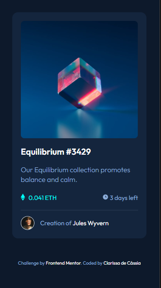

# Projeto-NFT-preview-card-component

## Sumário

  - [Sobre o projeto](#sobreoprojeto)
  - [Layout web](#layout-web)
  - [Tecnologias utilizadas](#tecnologias-utilizadas)
  - [O que eu aprendi](#o-que-eu-aprendi)
  - [Acesso a página](#acesso-a-página)

## Sobre o projeto

Esse desafio do Frontend Mentor consiste em  card perfeito  para treinar as propriedades de HTML e CSS. O layout do cartão não muda, porem nele já podemos utilizar tags semanticas no html e as propriedades do flex no css.

 ## Layout 

 

 

 

## Tecnologias utilizadas

- HTML 
- CSS 

## O que eu aprendi

Neste projeto, aprimorei os conhecimentos no uso de tags semanticas, div's e tambem o uso de flebox. Pude exercitar o uso de transparencia com hover ao passar o mouse em cima dos elementos.

## Acesso a página

Para ver o projeto pronto [clique aqui ](https://claricassia.github.io/Projeto-NFT-preview-card-component/)

